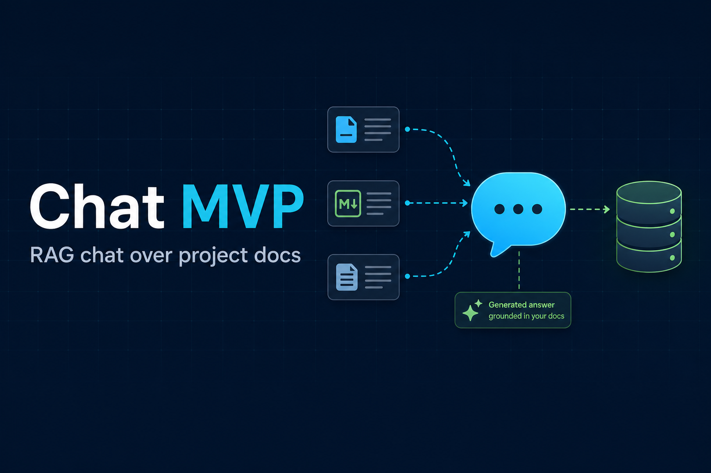

# Chat MVP



<p align="center">
  <a href="https://www.python.org/"></a>
  <a href="https://github.com/pgvector/pgvector"></a>
  <a href="https://fastapi.tiangolo.com/"></a>
  <a href="https://www.uvicorn.org/"></a>
  <a href="https://streamlit.io/"></a>
  <a href="https://python.langchain.com/"></a>
  <a href="https://huggingface.co/"></a>
  <a href="https://docs.pydantic.dev/"></a>
</p>

A minimal Retrieval-Augmented Generation (RAG) chat app over the
[`civictechdc/cib-mango-tree`](https://github.com/civictechdc/cib-mango-tree)
GitHub repo and a small set of related web pages. It ingests sources into
PostgreSQL (with `pgvector`), serves answers via a FastAPI backend, and
exposes a Streamlit chat UI.

## Stack

- Python 3.13.12
- PostgreSQL + [`pgvector`](https://github.com/pgvector/pgvector) extension
- LangChain (`langchain-core`, `langchain-huggingface`)
- Hugging Face Inference API (chat + embeddings)
- FastAPI + Uvicorn (backend)
- Streamlit (frontend)
- Trafilatura + BeautifulSoup (HTML extraction)

## Repository layout

```
backend/      FastAPI app exposing /health and /query (RAG over pgvector)
frontend/     Streamlit chat UI that calls the backend
corpus/       DB connection, schema reference, ingestion, embedding, chat history
  ingest/     GitHub README + seed-URL crawler and chunker
utils/        Shared helpers (env loading)
docs/         Project planning documents
.env.sample   Template for required environment variables
```

## Prerequisites

- Python 3.13.12 (a `.python-version` file is provided)
- A PostgreSQL database with the `pgvector` extension installed:
  ```sql
  CREATE EXTENSION IF NOT EXISTS vector;
  ```
- A Hugging Face API token (`PRIMARY_LLM_KEY`) for chat and embeddings

## Setup

1. Create and activate a virtual environment, then install dependencies:
   ```bash
   python3.13 -m venv .venv
   source .venv/bin/activate
   pip install -r requirements.txt
   pip install -e .
   ```
   `requirements.txt` installs third-party packages only. **`pip install -e .` is required**
   — it registers this repo (`backend`, `corpus`, `utils`) as an editable package
   so imports work from anywhere (eval scripts, `corpus` CLI, uvicorn). Run it from
   the repo root after every fresh venv or clone.
2. Copy `.env.sample` to `.env` and fill in values:
   ```bash
   cp .env.sample .env
   ```
   Required keys include `PGHOST`, `PGDATABASE`, `PGUSER`, `PGPASSWORD`,
   `PRIMARY_LLM_KEY`, `PRIMARY_LLM_MODEL`, `EMBEDDING_MODEL`, and
   `QUERY_TOP_K`. Crawl/chunk tuning vars are also listed in `.env.sample`.
3. Create the database tables. Reference DDL for `documents`,
   `chat_messages`, and `conversations` lives in `corpus/schema.py`; copy
   it into `psql` or pgAdmin.

## Ingest and embed sources

Sources are the project's GitHub README (plus dev files linked from it) and
the explicit URLs in `corpus/ingest/sources.py`. From the repo root:

```bash
.venv/bin/pip install -e .
.venv/bin/python -m corpus.ingest.crawl
.venv/bin/python -m corpus.embed
```

`crawl.py` fetches each source once, extracts text, chunks it, and writes
rows to `documents`. `embed.py` fills in missing embeddings with the
Hugging Face model in `EMBEDDING_MODEL` (default `BAAI/bge-base-en-v1.5`,
768-dimensional vectors). Re-running `crawl.py` replaces chunks per source URL.

## Run the app

In one terminal, start the backend:

```bash
.venv/bin/python -m uvicorn backend.main:app --reload
```

In another, start the Streamlit UI:

```bash
.venv/bin/python -m streamlit run frontend/app.py
```

The UI reads `CHAT_MVP_API_BASE_URL` (defaults to `http://127.0.0.1:8000`)
and posts questions to `POST /query`.

FastAPI auto-generates interactive API docs:

- Swagger UI: <http://127.0.0.1:8000/docs>
- ReDoc: <http://127.0.0.1:8000/redoc>
- OpenAPI schema: <http://127.0.0.1:8000/openapi.json>

## API

`POST /query`

Request body:

```json
{
  "query": "your question",
  "top_k": 5,
  "session_id": "optional-string"
}
```

Response:

```json
{
  "answer": "model answer grounded in retrieved context",
  "sources": [{"source_url": "...", "chunk_index": 0}],
  "session_id": "uuid-or-provided-id"
}
```

If `session_id` is omitted, the backend generates one and returns it so the
UI can continue the conversation. Chat history is persisted in
`chat_messages` and trimmed by token budget (`CHAT_HISTORY_MAX_TOKENS`,
default `3000`) before each model call.

`GET /health` returns `{"status": "ok"}`.

## Notes

- The backend uses pgvector similarity search to retrieve the top-`k`
  chunks, then asks the LLM to answer using only that context.
- Conversation history is used to interpret follow-up questions, not as a
  factual source.
- This is an MVP: no auth, no rate limiting, single-process deployment.
