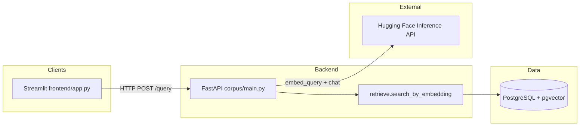
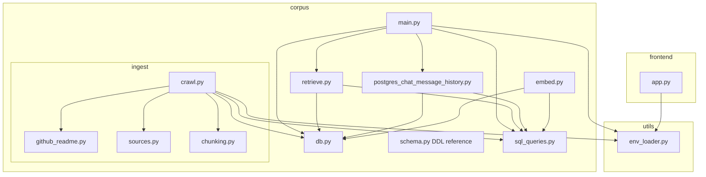
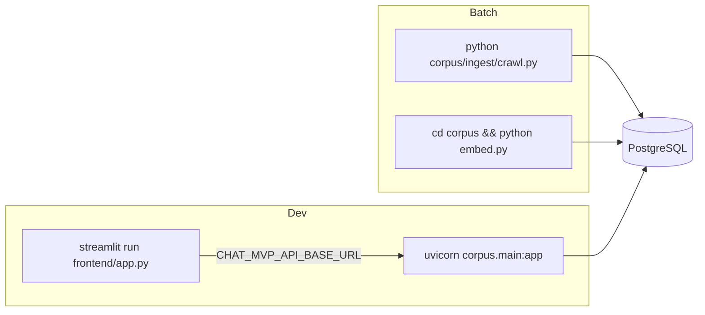

# Architecture overview (Mermaid)

High-level layout of the Chat MVP repo: Streamlit UI, FastAPI backend, PostgreSQL with pgvector, Hugging Face (chat + local embeddings), and offline ingestion scripts.

## System context

## Repository modules

## Runtime processes

`embed.py` is intended to be run from the `corpus/` working directory (its imports use `db` and `sql_queries` as top-level modules).
