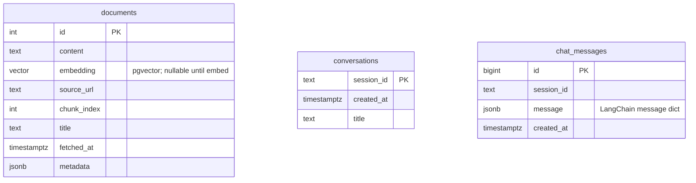
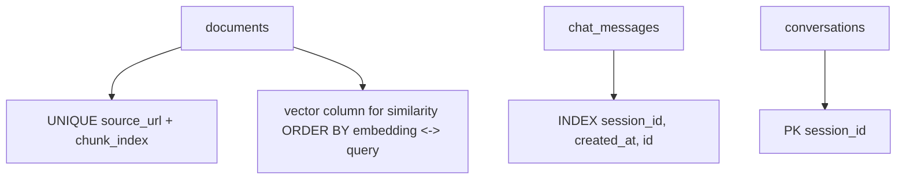

# Database schema (Mermaid ER)

Tables and relationships as defined in `corpus/schema.py` (reference DDL) and used by `corpus/sql_queries.py` and the app.

## Entity relationship

`conversations` and `chat_messages` are correlated by `session_id` at the application layer (`INSERT_CONVERSATION_IF_ABSENT` then chat rows for that id).

## Indexes and constraints (logical)

Vector dimension in schema reference: `vector(768)` for default `BAAI/bge-base-en-v1.5`.
