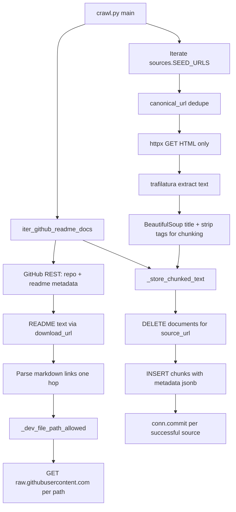
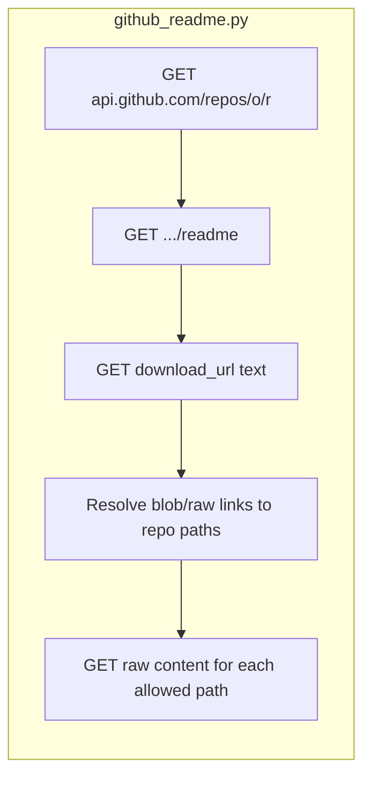
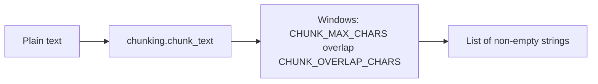
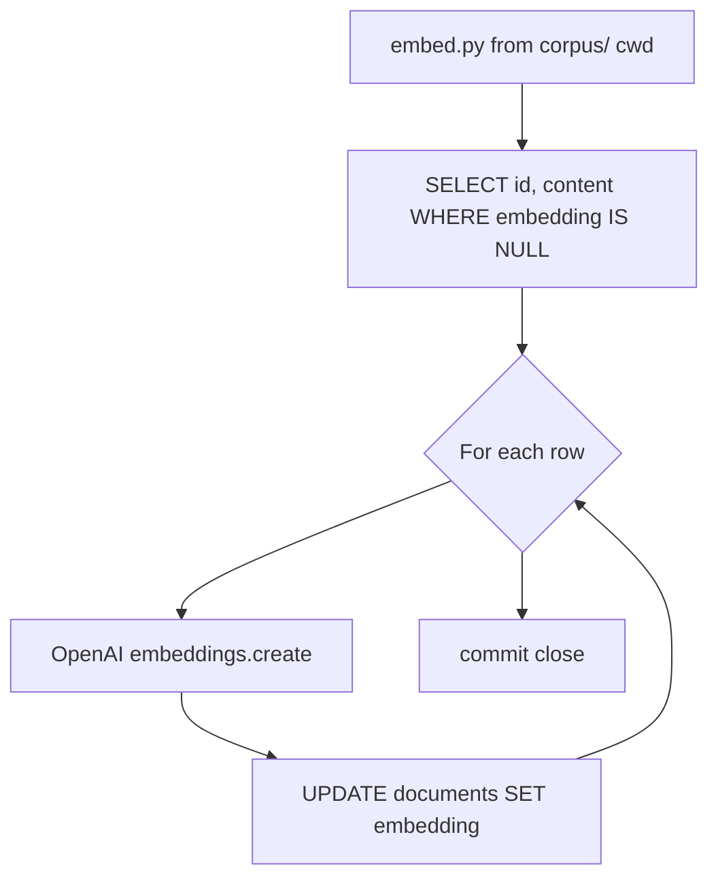

# Ingestion pipeline (Mermaid)

Offline jobs: `corpus/ingest/crawl.py` writes chunked rows to `documents`; `corpus/embed.py` fills `embedding` for rows where it is null.

## Crawl pipeline

## GitHub README branch (conceptual)

Constants `GITHUB_OWNER` / `GITHUB_REPO` and `SEED_URLS` live in `corpus/ingest/sources.py`.

## Chunking

## Embed job

## Env knobs (ingest)

| Area | Variables (from code / README) |
|------|----------------------------------|
| Crawl | `CRAWL_MAX_PAGES`, `CRAWL_REQUEST_TIMEOUT_S`, `CRAWL_DELAY_S`, `CRAWL_USER_AGENT` |
| Chunks | `CHUNK_MAX_CHARS`, `CHUNK_OVERLAP_CHARS` |
| DB / OpenAI | Same as app: `PG*`, `OPENAI_API_KEY`, `OPENAI_EMBEDDING_MODEL` |
