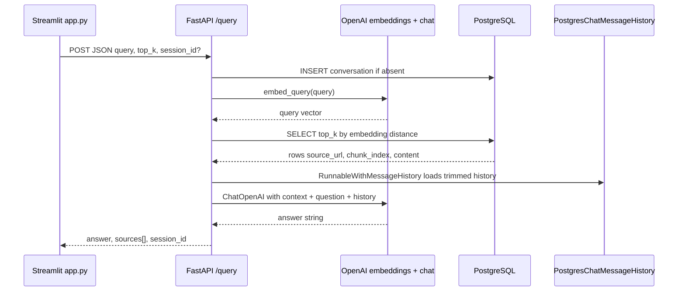
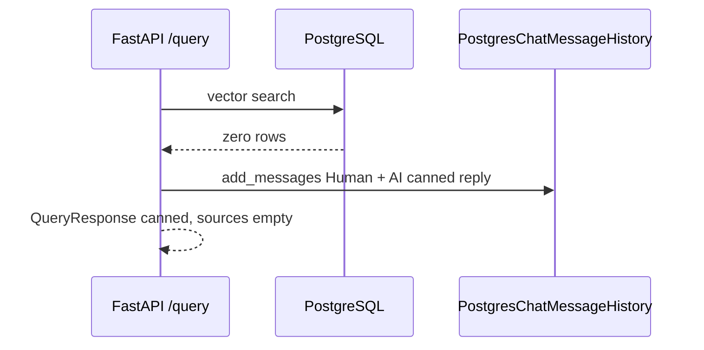
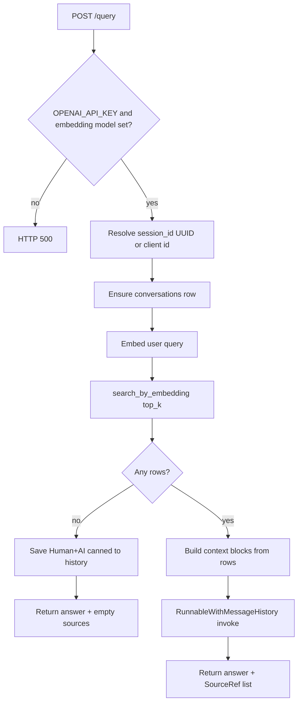
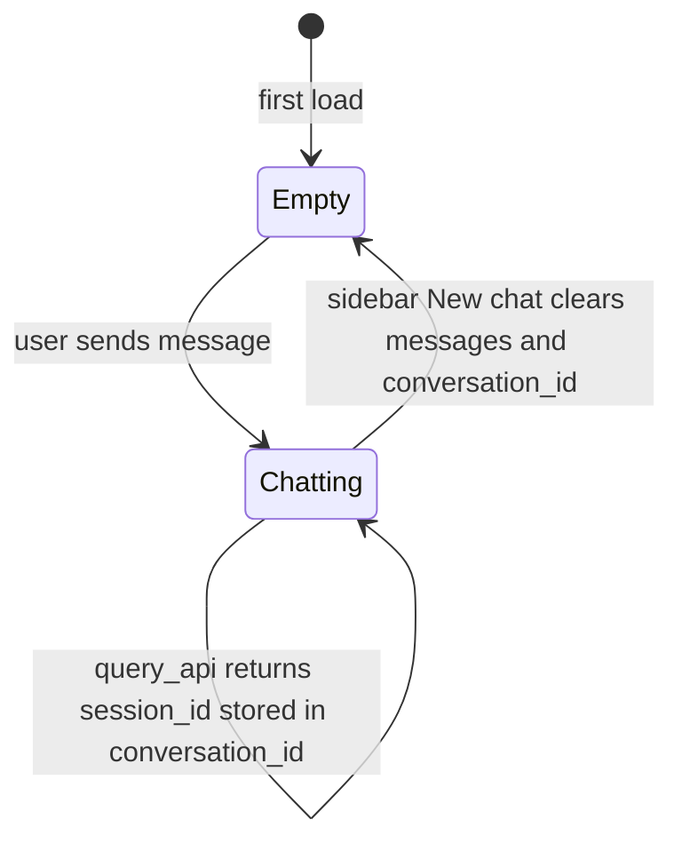

# RAG query and chat flow (Mermaid)

End-to-end behavior of `POST /query` in `backend/main.py`, the vector retrieval layer, and how the Streamlit client participates.

## Sequence: happy path

## Sequence: no matching documents

## Backend decision flow

## Streamlit session state

Environment: `CHAT_MVP_API_BASE_URL` (default `http://127.0.0.1:8000`), `QUERY_TOP_K` default for UI and server default on `QueryRequest`.
